# CRUD

## Exhibiendo datos #1

Con la carpeta de la clase descargada vamos a simular una base de datos.

Voy al navegador y abro <https://www.npmjs.com/package/json-server> luego copio el comando de instalación provisto en la pagina.

`npm install -g json-server` para instalarlo a través de la terminal.

Tenemos la palabra install, que hace referencia a que se instale y nuestra flag o una opción que es -g. En este caso es 
para que lo pueda instalar de manera global. Y por último tenemos el nombre de nuestro paquete o librería, que se llama 
json-server. Le voy a dar entonces aquí enter, voy a esperar a que descargue todas las dependencias o todo el código que
necesita para poder ejecutar y te veo cuando termine de hacer la instalación.

Con el comando `json-server` verifico que está instalado.

Para iniciar el servidor uso el comando: `json-server --watch db.json` *db.json* es uno de los archivos provistos.

Luego abro la dirección que generó ya sea copiando y pegando en el navegador o con ctrl + click en Vscode

http://localhost:3000/perfil

NO CERRAR LA TERMINAL

Descargue la extensión chrome json formatter.

**Ver curso de HTTP**

### AJAX Asynchronous JavaScript and XML

para comenzar creo la carpeta `service` y dentro el archivo `CLIENT-SERVICE.js`. Luego lo conecto desde el html.

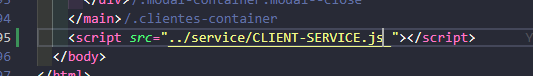

Compruebo la comunicación

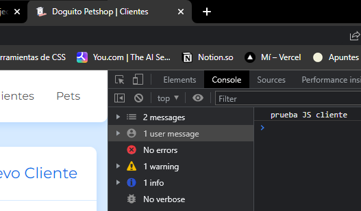

Creo una request

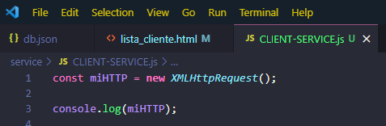

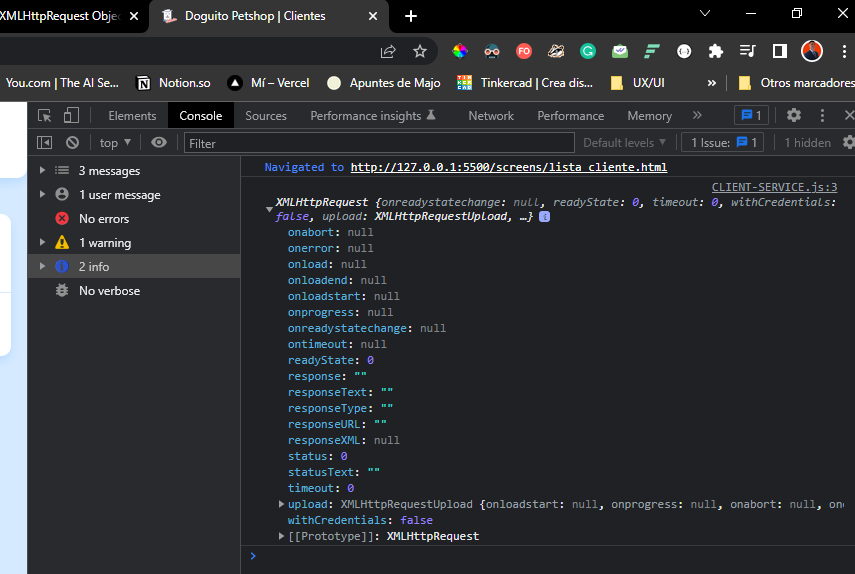

El resultado es una nueva instancia de la clase HTTPrequest con varios métodos

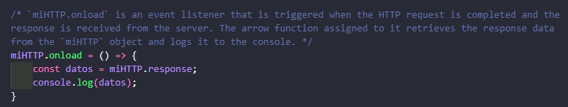 _Busco respuesta del servidor_

_Verifico la respuesta_

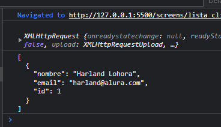 

### Creando templates

Creo un, `template` con el código HTML para generar en Js. los campos del formulario.

corté la seccion de html que creaba al usuario y creé en Js una función que lo genere desde ahí.

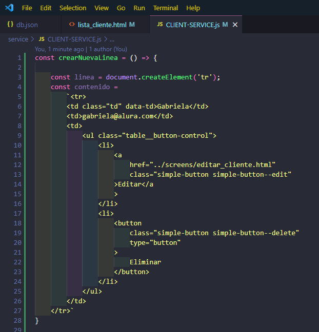

En este paso puedo borrar las etiquetas `tr` porque ya indico que lo genere, y hago dinámicos los campos 
Email y nombre queda así:

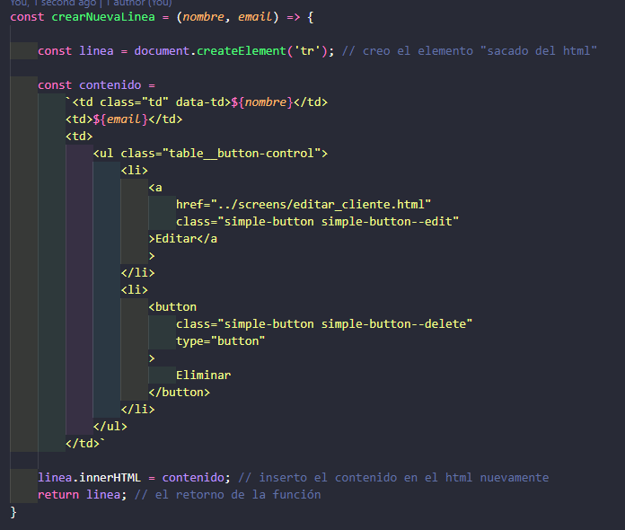

#### Ahora modifico a `miHTTP`

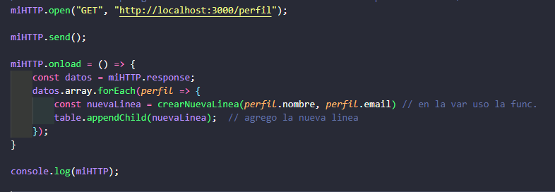

Esto va a dar un error:

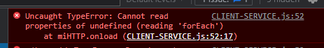 

Porque estamos usando un método de arrays y no lo ve como código sino como una string entonces lo debo transformar.

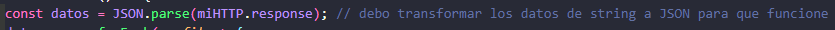

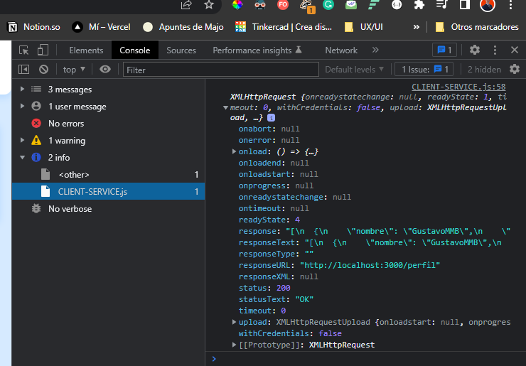

### Lidiando con Promises

