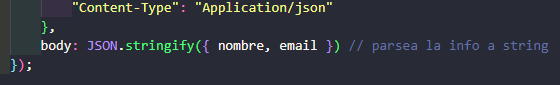
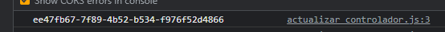

# CRUD

## Exhibiendo datos #1

Con la carpeta de la clase descargada vamos a simular una base de datos.

Voy al navegador y abro <https://www.npmjs.com/package/json-server> luego copio el comando de instalación provisto en la pagina.

`npm install -g json-server` para instalarlo a través de la terminal.

Tenemos la palabra install, que hace referencia a que se instale y nuestra flag o una opción que es -g. En este caso es 
para que lo pueda instalar de manera global. Y por último tenemos el nombre de nuestro paquete o librería, que se llama 
json-server. Le voy a dar entonces aquí enter, voy a esperar a que descargue todas las dependencias o todo el código que
necesita para poder ejecutar y te veo cuando termine de hacer la instalación.

Con el comando `json-server` verifico que está instalado.

Para iniciar el servidor uso el comando: `json-server --watch db.json` *db.json* es uno de los archivos provistos.

Luego abro la dirección que generó ya sea copiando y pegando en el navegador o con ctrl + click en Vscode

http://localhost:3000/perfil

NO CERRAR LA TERMINAL

Descargue la extensión chrome json formatter.

**Ver curso de HTTP**

### AJAX Asynchronous JavaScript and XML

para comenzar creo la carpeta `service` y dentro el archivo `CLIENT-SERVICE.js`. Luego lo conecto desde el html.

Compruebo la comunicación

Creo una request

El resultado es una nueva instancia de la clase HTTPrequest con varios métodos

 _Busco respuesta del servidor_

_Verifico la respuesta_

 

### Creando templates

Creo un, `template` con el código HTML para generar en Js. los campos del formulario.

corté la seccion de html que creaba al usuario y creé en Js una función que lo genere desde ahí.

En este paso puedo borrar las etiquetas `tr` porque ya indico que lo genere, y hago dinámicos los campos 
Email y nombre queda así:

#### Ahora modifico a `miHTTP`

Esto va a dar un error:

 

Porque estamos usando un método de arrays y no lo ve como código sino como una string entonces lo debo transformar.

### Lidiando con Promises

El objeto Promise representa la eventual finalización (o falla) de una operación asincrónica y su valor resultante.

Una Promesa (Promise) es un proxy de un valor que no necesariamente se conoce cuando se crea la promesa. Le permite 
asociar controladores con el valor eventual de éxito o el motivo de falla de una acción asíncrona.

Modifico el código para que sea una promesa.

llamo a la promesa

### Reescribiendo con Fetch API

La API Fetch proporciona una interfaz JavaScript para acceder y manipular partes del canal HTTP, tales como peticiones 
y respuestas. También provee un método global fetch() (en-US) que proporciona una forma fácil y lógica de obtener 
recursos de forma asíncrona por la red.

fetch toma automáticamente el método GET

Este ejemplo reduce mucho las líneas de código

Y puede ser reducido a esto porque al ser funciones simples podemos eliminar las llaves y el return.

### Refactorizando responsabilidades

Los cambios son muchos, creo un archivo separado para el manejo del html, desde el JS principal (CLIENT-SERVICE) exporto 
ahora al nuevo archivo cliente_controlador, por esa razón debo modificar en el html la ruta y decir que ahora son tipo modulos

En el nuevo controlador comunico a través de, `serviciosCliente.` a la función que obtiene datos para rellenar los 
campos de la tabla con el objeto nuevo

### Event Loop

http://latentflip.com/loupe/?code=JC5vbignYnV0dG9uJywgJ2NsaWNrJywgZnVuY3Rpb24gb25DbGljaygpIHsKICAgIHNldFRpbWVvdXQoZnVuY3Rpb24gdGltZXIoKSB7CiAgICAgICAgY29uc29sZS5sb2coJ1lvdSBjbGlja2VkIHRoZSBidXR0b24hJyk7ICAgIAogICAgfSwgMjAwMCk7Cn0pOwoKY29uc29sZS5sb2coIkhpISIpOwoKc2V0VGltZW91dChmdW5jdGlvbiB0aW1lb3V0KCkgewogICAgY29uc29sZS5sb2coIkNsaWNrIHRoZSBidXR0b24hIik7Cn0sIDUwMDApOwoKY29uc29sZS5sb2coIldlbGNvbWUgdG8gbG91cGUuIik7!!!PGJ1dHRvbj5DbGljayBtZSE8L2J1dHRvbj4%3D

## Creando un cliente

Creo un módulo para crear los nuevos registros y lo conecto al html `registrar cliente`.

Necesito escuchar el submit .. Ahora vamos a tener nuestra constante formulario y nosotros podemos ya tener disponibles 
diferentes métodos. El que queremos es addEventListener, es decir agregar un escuchador. Recibe aquí dos parámetros. 
El primero es el tipo de evento que quiere escuchar, que en este caso va a ser submit y el segundo, una función que se 
va a disparar una vez que el usuario o que se cumpla esta condición.

Los formularios tienen un comportamiento _ya definido dentro de JavaScript_ o dentro del navegador. 
Lo que nosotros queremos es prevenir que funcione como ya está definido. Para eso, nosotros aquí recibimos nuestro 
evento.

Dentro de este evento tenemos una propiedad que se llama `.preventDefault` y lo mandamos a llamar. Es decir, no queremos
que este formulario funcione como normalmente debería. Para eso, vamos a utilizar este método. Ahora, ya tenemos nuestro
evento. Esta función que se mandó a llamar.

Para recuperar los datos en este caso usamos los `data-attributes`  

Solo queremos el valor así que agregamos `.value`

Ya tenemos capturada la información, ahora necesitamos delegar la responsabilidad a otra función que
reciba esos datos y que se encargue de enviárselos a nuestro servidor o a nuestra API.

en el archivo `CLIENT-SERVICE` creo la función y le paso los parámetros nombre y mail - 

**Muy importante No debo usar `get` que está por defecto** necesito usar POST

Vamos a ver entonces cómo es que podemos decir la **fetch** que trabaje con otro método.
 
Primero va a recibir la URL a la cual se va a conectar y después va a recibir un segundo parámetro, que va a ser un _**objeto.**_ 
En este objeto vamos a definir las demás propiedades de la llamada. Nosotros vamos a decir aquí cuál va a ser el método 
o method: Que será POST Después, dentro de este mismo objeto, vamos a definirle los _encabezados_. 
Estos encabezados son como para tener un estándar o que el servidor sepa qué tipo de archivo es el que va a recibir. 
Vamos a poner entonces es headers y va a ser un nuevo objeto, y dentro de este objeto, vamos a definir el Content-Type. 
A este Content-Type le vamos a decir que va a ser un "application/json".

Por último le vamos a definir también cuál va a ser el body o el cuerpo, que al final de cuenta termina siendo un objeto. 
En este objeto es donde nosotros vamos a poner toda la información que nosotros queremos que se envíe a través del cuerpo 
de la petición. Entonces vamos a poner que queremos el nombre y el correo electrónico. 
La comunicación http trabaja con texto, lo que necesitamos ahora es transformar este objeto en texto.

Utilizando JSON.stringify  Entonces lo que le estamos mandando aquí ya es un objeto, pero JSON.stringify se va a encargar 
de formatearlo en texto para que lo pueda enviar http. 

Antes de probar todo esto, es si nosotros venimos aquí a nuestro db.json, tenemos tanto el nombre, el correo electrónico y el `id.`
para simplificar usamos una librería -- UUID CDN -- https://cdnjs.com/libraries?q=uuid

No la instalo sino que la agrego via link al html.

Puedo acceder al método desde la consola: escribiendo uuid

usamos la version 4 con esta sintaxis: `uuid.v4()` + enter y cada vez que lo use genera un ID nuevo.

 Así lo uso

Ahora lo debo exportar: 

Lo importo en registro-controlador:

En el controlador de registros queda así: 

Esta es la respuesta:

Y todo esto generó un nuevo usuario en la base de datos:

Para mejorar la experiencia de usuario lo redirijo a la página de registro completado:

Queda esto luego de completar

### Borrar clientes

https://app.aluracursos.com/course/js-web-crud-javascript-asincrono/task/77103

En esta clase hace un refactor del código:

Cambia a este

 trata como un objeto a los datos / parámetros

Creo función para borrar clientes, en `cliente-controlador` dentro de la func. `crear nueva linea` selecciono el botón 
**Hay uno solo!!** porque edit aunque en pantalla parezca un botón es un `<a>`.

Luego lo escucho.

Ahora que escucho el botón debo ir al backend y crear una nueva función para la lógica de borrar

 son backticks no comilla

De vuelta en cliente controlador termina el código

Lo que aprendimos en esta aula:

* Usar el método closest para encontrar el elemento del DOM más próximo al cual queremos remover.
* Crear un cliente utilizando el verbo http POST.
* Remover un elemento del dom con el método remove().
* Borrar un cliente utilizando el verbo http DELETE.

## Editar datos

Para editar datos primero debo identificar a cual cliente estoy editando, entonces en la etiqueta `<a>` en la ruta le 
agrego: `?${id}` 

se puede ver en el navegador: 

 -- 

Para poder trabajar con esos parámetros le ponemos nombre: `? id = ${id}` **¡para que funcione se escribe todo junto esto es solo ejemplo!**

Luego de hacer el link desde html al script de actualizar_controlador creo una const : `const url = new URL(window.location)`
con este resultado:

 Busca el parámetro en este caso id

Creo la función para obtener los datos

resultado

Lo que necesitamos hacer es indicarle a este formulario cuál es el nombre y que lo autocomplete con nombre, y el email

### Editando (No entendí)

### Async await

Código mejorado:

